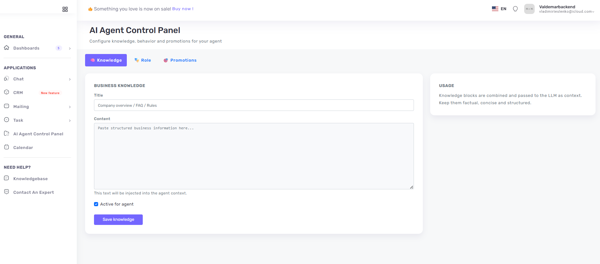
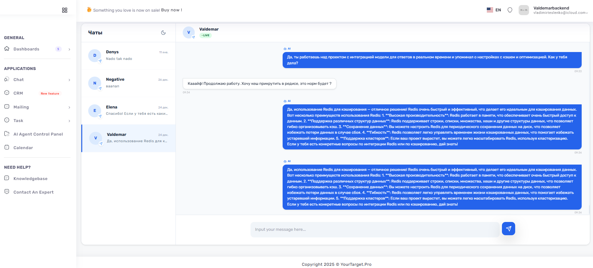
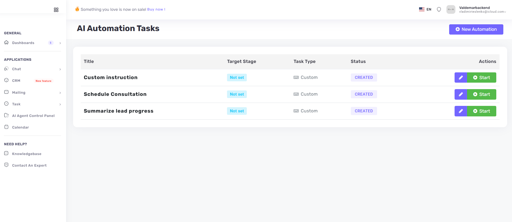

# YourTarget.pro — AI-Powered Automation SaaS

**YourTarget.pro** is an intelligent communication hub designed to bridge the gap between manual customer support and fully autonomous AI management. Currently optimized for **Telegram**, the platform allows businesses to monitor chats in real-time, intervene manually, or deploy specialized **AI Agents** that drive customers through the sales funnel.

> **Note:** This is a showcase repository. The source code is private.

---

### 🚀 Core Functional Modules

#### 1. Smart Omnichannel Chat & Kanban
The platform provides a centralized interface for managing leads across messengers.
* **Real-time Interaction:** Handle incoming Telegram messages in a sleek, responsive UI.
* **Lead Pipeline:** A built-in **Kanban Board** to track the status of every conversation (`/api/chat/kanban`).
* **Manual Override:** Seamlessly switch from AI to human mode when a personal touch is needed.

*Visualizing the sales funnel and active lead stages.*

#### 2. The AI Agent (RAG-Enabled)
The "brain" of the application is an AI Agent that operates on your specific business data.
* **Knowledge Base:** The agent uses your private database to provide accurate, non-generic consultations (`/api/chat/knowledgebase`).
* **Goal-Oriented:** Programmed to move users through specific funnel stages.
* **Task Execution:** The agent can trigger custom tasks, such as scheduling or data extraction, directly during the chat (`/api/chat/tasks`).

*Configuring AI behavior and training the Knowledge Base.*

#### 3. Messenger Integration Layer
* **Instant Connectivity:** Add new Telegram bots via a simple API call (`/api/telegram/add-telegram-bot`).
* **Async Processing:** Built with **FastAPI** webhooks to ensure zero-latency message handling.
* **Future-Ready:** Architecture prepared for WhatsApp and Instagram integration.

*Real-time AI-assisted conversation flow.*

*Task automation flow.*

---

### 🛠 Technical Architecture

The system follows a clean, asynchronous architecture:

* **Backend:** Python 3.11+ | FastAPI (Async) | SQLAlchemy 2.0.
* **AI Stack:** LangGraph | LangChain | Ollama (Local LLMs) | PGVector.
* **Infrastructure:** PostgreSQL | Redis | Docker & Docker Compose.

#### Key API Endpoints (Architecture Preview):
* `POST /api/telegram/webhook/{bot_username}` — High-speed message processing.
* `PATCH /api/chat/{id}/status` — Managing the lead lifecycle.
* `POST /api/chat/tasks/{task_id}/run` — Triggering automated business logic.

---

### 🛣 Roadmap
- [x] Telegram Integration & Webhook Handler
- [x] AI Agent with RAG (Knowledge Base)
- [x] Kanban & Task Management System
- [ ] WhatsApp Business API Integration
- [ ] Instagram Direct Support

---

### 👨‍💻 Contact & Demo
* **Official Website:** [YourTarget.pro](https://yourtarget.pro)
* **Developer:** Volodymyr Teslenko
